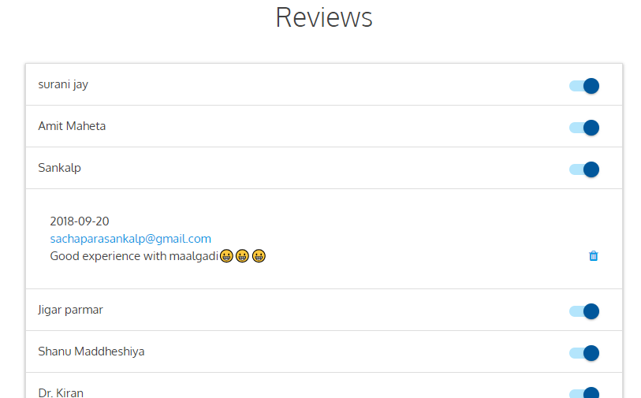
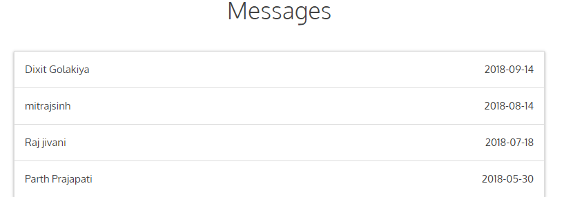
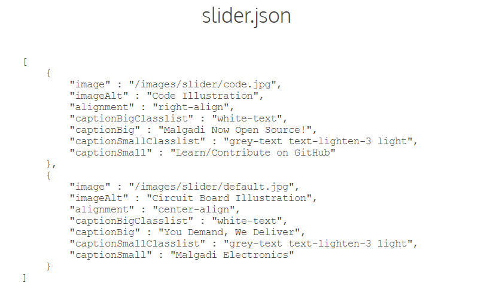
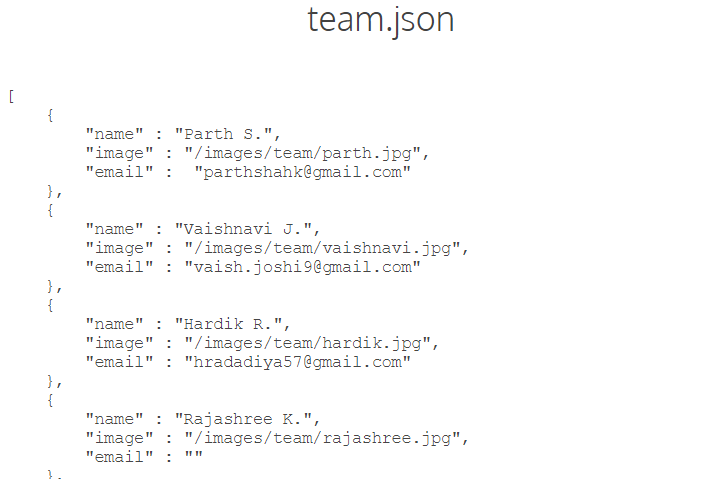
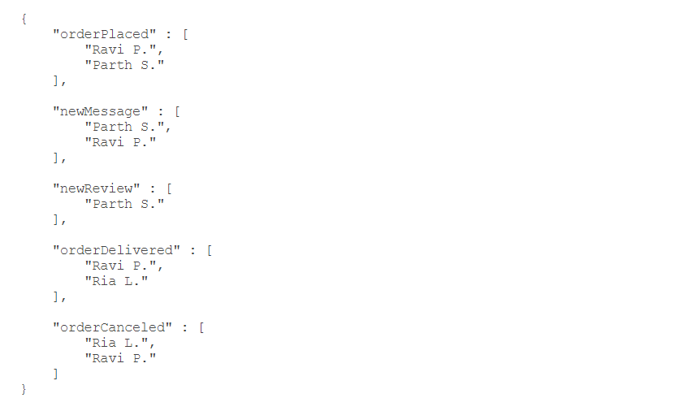
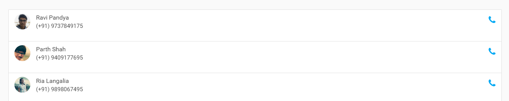
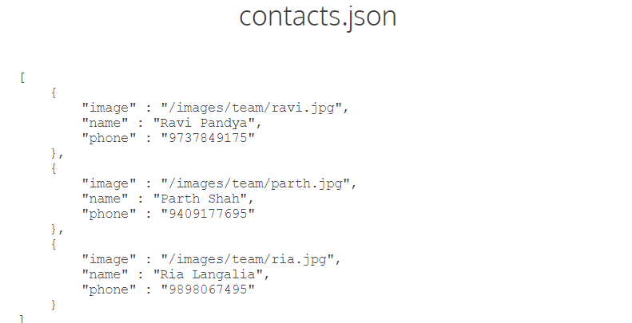

<h1 align="center"><b>Malgadi Electronics Documentation</b></h1>

    
     
    <a href="http://electronics.malgadi.co.in" target="_BLANK">http://electronics.malgadi.co.in</a>

## **About Malgadi**
Malgadi is a for the students, by the student's venture. It is a non-profitable organization started by the college students to provide better quality electronic components at a reasonable rate. Along with this, we also organize workshops and seminars in colleges to impart technical knowledge to students.

We intend to develop this platform and extend its reach to as many students as possible, hence making technical education a bit more interesting. This is the platform which made us technically potent along with an experience of entrepreneurship.

    
     
    Malgadi is a subsidiary company of <a href="http://heavensolarenergy.com" target="_BLANK">Heaven Solar</a>.

---

## **The Website**
The **Malgadi Electronics** website for the user, works similar to any other online shopping website:-

1. Add items to cart
2. Checkout
3. Provide delivery information
4. Place order

Apart from this, other functionalities on the website are:-

- Search for a product
- Send a message
- Track Order
- Write a Review
- Subscribe to an _Out of Stock_ product

---

## **The Member Section**

The **Member Section** is located at `/manage` of the root directory. It is intended to be used by the members to control and manage the website. The following pages are available in the member section:-

- Pending Orders (Home)
- All Orders
- Products
- Reviews
- Messages
- Statistics
- Configurations

These pages gives full control of the website to the manager. All these functionalities are described later in the documentation.

---

## **Technologies Used**

Following are the technologies used in the production of this application.

#### HTML
HTML5 is used for basic markup in web pages.

#### CSS ([MaterializeCSS](https://materializecss.com/))
Materialize CSS is used for the front-end components. Materialize CSS is a modern responsive front-end framework based on Material Design.

#### JavaScript
JavaScript is used for the interactivity on the client side.

#### AJAX
AJAX is used to make calls to the API which manages the cart.

#### JSON
JSON is used to store configuration data for some webpages.

#### PHP
Core PHP is used to create the API and which handles almost everything from user messages to product information.

#### MySQL
MySQL database is used to store data on server.

---

## **Using the Member Section**

The **Member Section** requires a password to be accessed, for obvious reasons. There are 2 different level of privileges for **Member Section**.

1. Master Login
2. Normal Login

Both of these passwords are hard-coded in the PHP script in the form of _SHA-1_ Hash.

#### Master Login
This privilege level offers all the functionalities required to handle the website. It consists of all the following pages:-

- Pending Orders (Home)
- All Orders
- Products
- Reviews
- Messages
- Statistics
- Configurations

#### Normal Login
This privilege level offers only sufficient information to non-technical members. It consists of the following pages:-

- Pending Orders (Home)
- All Orders
- Statistics

---

## **Member Section Components**

### Pending Orders

    

Pending orders are listed in the form of _drawers_ for each order. Clikcing on these drawers will pull all the information of that order as shown below. The number on the _drawer handle_ indicates the Order ID.

    

Clicking on the Email ID or the phone number will directly open the email app and the caller app respectively, so there is no need to copy it when needed.

To mark the order as delivered hit the deliver button in the drawer and to cancel the order, hit the cancel button. To perform this action the member must select their name from the top dropdown, so that there is always a record of who handled which order. Once these actions are performed, there is no going back because emails of confirmations have been sent by this time.

    

The Stock Requirement function will list out all the products along with quantities required to complete the pending orders. Moreover it will also show the order ID of that product requirement. Same information, different view.

### Orders

    

This page will display all the orders from the database. The drawers are marked with the order status of `pending`, `canceled` and `delivered`. Opening the drawer will show the same information as in the Pending Order section and will also show who `delivered` or `canceled` the order. An order can also be searched by the order ID using the search form available at the top of the page.

### Products

This page displays and controls all the products available on the website.

    

The top part of this page contains the following components:

- Search 
Used to search a product by the product ID. The product ID can be known by looking at the URL of the _item page_ on the website. The number after `q` in the URL is the product ID.

- Waiting List 
This will display the number of people "waiting" for an out of stock product. When a user uses the `Notify Me` feature for the out of stock products, that information is shown here. When the product is made _in stock_, these users are automatically notified via email.

- Add Product 
This function can be used to add new products to the website. It is very important to follow the _Add Product Guidelines_ in order for the website to function correctly. These instructions are avilable at the top of the _Add Product_ page.

The rest of the page contains the listing of the individual items. Each item has it's own card. Each card looks like the one showed below.

    

The number in the heading is the item ID followed by the _Full Name_ of the item. The `waiting` shows the number of people who are _Waitng_ for the product to be in stock, i.e. the number of people who used the `Notify Me` feature for an out of stock item. Once the item is in stock, these people are automatically notified via email.

Further, there are 3 switches, `Stock Status`, `Homepage` and `Featured`. The use of each switch is described below.

- Stock Status 
If the item is in stock, leave the switch _on_. And to make the item out of stock, simply turn off the switch. Easy!

- Homepage 
If this switch is turned on, the item will show up on the homepage of the website. Use this feature to display most common items on the homepage. The _homepage_ items will be shown **after** the _connect with us_ section on the homepage.

- Featured 
If this switch is turned on, the item will show up in the top part of the homepage. This function is reserved for top selling products of the website. The _featured_ items will be shown **before** the _connect with us_ section on the homepage.

> **Please Note** 
> - Do not turn on both _homepage_ and _featured_ switches. Doing so will display the product twice on the homepage.
> - Try to keep the number of _featured_ items around 4 and the number of _homepage_ items no more than 20. This will ensure a nice view of the page and fast loading.

There are 2 more functions remaining, `edit` and `delete`. To make changes in the information of an item use the `edit` function. Just like `Add Item`, `edit` also has some guidelines that are to be followed. These instructions will be available on the edit page itself. And finally, the `delete` option will permanently delete the item from the website. There is no going back from this.

### Reviews

This page will display all the reviews submitted by the users. Each review is on the form of a _drawer_. Clicking on the _drawer_ will display the review as shown below.

    

Each drawer has a switch on the right. This switch controls the visibility of the review. When a new review is posted, it won't be visible on the website right away. The switch will be _off_ for the new review. If the review is worth showing on the website, simply turn on the switch.

### Messages

This page will display the _Contact Messages_ and the _Special Orders_ of the users, submitted via the website.

    

Just like reviews, each message as a separate _drawer_. Clicking on the drawer will display the message.

### Statistics

On this page, all sorts of statistics are available for analysis. These statistics include sales, orders, views, users, various comparison graphs, etc.

### Configurations

This page allows you to change certain configurations of the website. In order to use this, knowledge of `JSON` language is required because these configurations are stored in json format.

There are 4 configuration files that control various aspects of the website. Each described below:

#### Slider.json
This configuration is for the _full width image slider_ on the homepage of the website.

Each image has a caption and a sub caption. Any number of slider images are possible, but it does affect the page loading time. Thus, about 3 images would be just fine. The image path has to be provided in the `image` key of json.

The 2 captions keys in json are - `captionBig` and `captionSmall`, for a caption and sub caption respectively.

The caption and the sub caption, both have it's own (MaterializeCSS) classes. These keys are available in the json as well, namely `captionBigClasslist` and `captionSmallClasslist`. Use these to change the colors of the caption. Refer MaterializeCSS [website](https://materializecss.com) for color classes.

To add/remove a slider image, simply add/remove objects to the array.

Refer MaterializeCSS [website](https://materializecss.com) for more information on the _full width slider_.

The JSON slider data looks like this:

    

#### Team.json

This file maintains a list of current team members of Malgadi Electronics. Further, this list is used on the about page to display images and in notifications.json for configurations. Thus team.json is important to maintain. It looks like this:

    

Save the image in the given directory and provide the relative path in the `image` key. The `email` key is required for notifications (for notifications.json).

Simply add/remove the objects as shown in the json array to add/remove team members.

> **Please Note** 
> In order to display team member images properly on the about page, the dimensions of all images should be _square_.

#### Notifications.json
In this application, whenever an there is some activity on the website - placing an order, submitting a message, etc., The desired team members are notified automatically by email. This file stores the name of the people to be notified on various events as explained below.

- **orderPlaced**: When a new order is placed through the website.
- **newMessage**: When a user submits a _contact message_ / _special order_.
- **newReview**: When a new review is posted.
- **orderCanceled**: When an order is canceled through the member section.

The file looks like this:

    

> **Important** 
> - Use exact names used in the team.json file because it fetches the email of the person from team.json file.
> - Do not put more than 3 names per category because there is some time cost in sending these email.

#### Contacts.json

When the _call_ button is pressed on the website, the following modal pops up:

    

This file configures the people shown in this modal.

The file looks like this:

    

This file's on it's own. Thus, names can be different in it. You may use the same image path used in the team.json.

Simply add/remove objects in the array to add/remove people from the contact modal. Any number of people in the modal is possible but 3 is most favourable.

---
## **Other Provisions** 

### Database Auto Backup
The folder `/db-backup` contains a backup generator of the database. It generates a database backup in the same folder and updates it every week. So if anything was to happen to the database, you may find a backup in this folder.

### Error Sweeper
This file is present in the root directory. It _sweeps_ the website's error logs periodically and notifies the person whose email ID is provided in the file about the error if found.

---

This covers everything that is required to run the website without any issues. If everything is followed in the documentation, the website is least likely to show any errors ever.